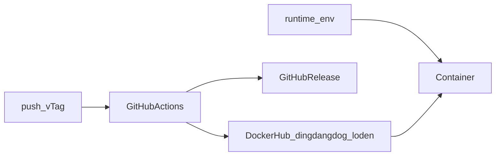

# LodenBlog 闭源转开源安全整改与 Docker 发布

## 1. 背景与目标

- 当前问题：仓库曾作为闭源个人站点维护，源码、Dockerfile、Compose 中存在弱密钥、个人域名、AdSense Publisher ID，以及可能被误提交的本地 env 文件；缺少 LICENSE、`.env.example` 与自动发镜像工作流。
- 目标用户与场景：将本仓库公开到 GitHub，使他人可安全克隆、配置与部署；维护者推送 `v*.*.*` tag 后自动构建并推送 Docker 镜像。
- 成功标准：公开仓库与公开镜像中不再含真实密钥或弱默认口令；敏感项仅通过运行时环境变量注入；`dingdangdog/loden` 可按 tag 自动发布。
- 非目标：不改登录、发文、广告投放等业务逻辑；不改密码哈希算法；不改 Prisma schema、不生成 migration；不启动开发/生产服务；不做服务器侧 `update.sh` 自动滚动。

## 2. 现状与约束

- 现有架构：Nuxt 4 + Prisma + PostgreSQL，Docker 多阶段构建，Auth.js（sidebase/nuxt-auth），系统配置与广告 ID 存数据库。
- 技术约束：密码为 SHA256 + `NUXT_SALT`；存量用户哈希依赖现有盐值。去掉代码中的弱默认值后，已部署实例必须继续提供原来的 `NUXT_SALT` / `NUXT_AUTH_SECRET`。
- 安全约束：不读取、不提交 `.env` 与裸文件 `env` 的值。
- 发布约束：镜像名已确认为 `dingdangdog/loden`；工作流对齐 `XLangAI/servers` 的 tag 触发、多架构构建与 GitHub Release。

## 3. 方案概览

单一事实来源：密钥与站点身份只来自运行时环境变量或系统初始化配置，不再写进源码、镜像层或示例文件的真实值。GitHub Actions 在校验 `vMAJOR.MINOR.PATCH` tag 后构建并推送 `dingdangdog/loden`，再创建 GitHub Release。

## 4. 详细设计

### 4.1 配置与密钥

- 删除源码中的 `login123` / `salt123` / 数据库口令默认值；未设置 `NUXT_AUTH_SECRET`、`NUXT_SALT` 时启动失败。
- Dockerfile 不再 bake 密钥、个人域名或个人邮箱；版本号通过 `APP_VERSION` / `BUILD_SHA` build-arg 注入。
- Compose 敏感项改为 `${VAR}`，并声明 `image: dingdangdog/loden:latest` 与本地 `build`。
- 新增 `.env.example`，仅占位符。

### 4.2 个人标识与公开静态文件

- 删除静态 `public/ads.txt`（`/ads.txt` 已由服务端按系统配置动态生成）。
- `robots.txt` 不再写死个人站点 Sitemap。
- 后台文案与配置说明中的真实 Publisher 示例改为明显假值。
- 信息页模板占位域名 `lodenhu.com` 改为 `example.com`，同步替换函数；已入库正文不受影响。

### 4.3 仓库卫生与开源文件

- `.gitignore` / `.dockerignore` 覆盖裸 `env`、密钥与 dump 类文件。
- 增加 MIT LICENSE、开源 README、workflow。
- 删除 `test-password.js` 与启动时打印测试口令的 `initDefaultUser`。

### 4.4 Docker 发布工作流

- 文件：`.github/workflows/docker-release.yaml`
- 触发：`push` tags `v*.*.*`
- Environment：`docker_hub`
- Secrets：`DOCKER_USERNAME`、`DOCKER_PASSWORD`
- 平台：`linux/amd64,linux/arm64`
- 标签：`dingdangdog/loden:<tag>` 与 `:latest`
- 镜像推送成功后创建 GitHub Release

维护者需在 GitHub 新建 Environment `docker_hub`、配置 Secrets，并在 Docker Hub 创建仓库 `loden`。

### 4.5 日志、审计、隐私与安全

- 启动日志不再打印默认测试账号明文密码。
- 不在公开文档中复述任何真实密钥。
- 开源前由维护者自行轮换曾出现在本地 env 中的 OAuth / R2 / 数据库口令。

## 5. 失败与恢复

- GitHub Secrets 缺失：workflow 在 Docker login 失败，不推送镜像、不发 Release。
- tag 格式非法：校验步骤失败并退出。
- 存量部署未设置 `NUXT_SALT`：进程启动失败，避免用未知盐重算密码；恢复方式是在运行环境写回原来的盐值。

## 6. 兼容与数据处理

- 存量数据：用户密码哈希不变；已初始化信息页正文不变。
- 无 Prisma schema 变化，不生成 migration。
- 回滚边界：若公开后发现仍有密钥，立即轮换并清理 Git 历史（若已推送）。

## 7. 实施顺序

1. 持久化本方案。
2. gitignore / dockerignore / 删除测试脚本与静态 ads.txt。
3. 去掉弱默认值与个人标识。
4. 新增 `.env.example`、LICENSE、workflow，修正 compose，重写 README。
5. 写 changelog 并静态核对 diff。

## 8. 验证与验收

- 静态检索：仓库中不再出现 `login123`、`salt123`、真实 AdSense 示例、`lodenhu.com` 默认 Auth URL、Dockerfile 内数据库口令。
- 确认 `.env` / `env` 仍被 ignore。
- 不启动服务；不执行真实 Docker 推送。

## 9. 发布与回滚

- 发布：`git tag vX.Y.Z && git push origin vX.Y.Z`
- 回滚：保留旧镜像 tag；必要时在 Docker Hub 删除误发的 `latest`。
