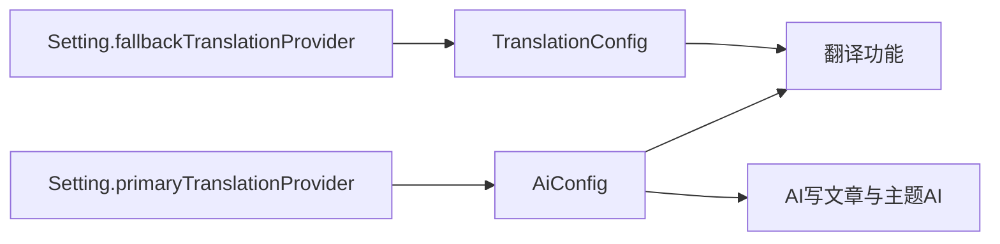

# 拆分 TranslationConfig 与 AI 配置表

## 1. 背景与目标

- 当前问题：`TranslationConfig` 同时存储机器翻译（DeepL、Google 等）和 AI 服务商（OpenAI、Gemini 等）。AI 写文章、主题生成也查询该表，并误用 `fallbackTranslationProvider`（机器翻译）作为默认 AI。
- 目标用户与场景：管理员分别配置 AI 服务商与机器翻译；翻译任务仍可选用 AI；AI 写文章/主题生成只使用 AI 配置。
- 成功标准：
  - 两张表职责分离，字段形状保持一致。
  - 翻译功能可按 ID 解析 AI 或机器翻译配置。
  - AI 写文章、主题生成/优化只查询 `AiConfig`。
  - 系统设置「AI翻译」指向 `AiConfig`，「机器翻译」指向 `TranslationConfig`。
- 非目标：不由 AI 生成 Prisma migration；不引入 Prisma `@relation`；不把运行时配置类型重命名为另一套结构。

## 2. 现状与约束

- 现有架构：`Setting.primaryTranslationProvider` / `fallbackTranslationProvider` 注释写的是关联 `TranslationConfig.id`，但后台文案已区分为「AI翻译」与「机器翻译」。连通性测试已把机器协议固定为 `deepl/volcano/google/baidu/tencent/youdao`。
- 技术约束：约定式外键（无 Prisma relation）；AI 不得生成 migration 文件；不启动开发服务器。
- 已知历史问题：`getProviderConfigForAI` 默认优先 `fallbackTranslationProvider`，与「AI 翻译」语义相反。

## 3. 方案概览

将原表拆为 `AiConfig`（AI 服务商）与 `TranslationConfig`（机器翻译）。翻译查询两表；AI 调用只查 `AiConfig`。存量 AI 行在应用启动时按原 ID 幂等迁入新表。系统设置新增「AI 配置」Tab。

## 4. 详细设计

### 4.1 数据模型与权威来源

服务商分类（单一事实来源：`server/utils/provider-kind.ts`）：

- 机器翻译：`deepl`、`volcano`、`google`、`baidu`、`tencent`、`youdao`
- 其余一律视为 AI（含 `openai`、`openai-gpt35`、`gemini`、`alibaba`、`deepseek`、自定义 OpenAI 兼容）

`AiConfig` 字段与 `TranslationConfig` 对齐：`id/name/provider/apiKey/apiSecret/apiEndpoint/timeout/maxRetries/priority/extraConfig/isActive/createdAt/updatedAt`。物理表名 `ai_configs`。

Setting 约定：

- `primaryTranslationProvider` → `AiConfig.id`
- `fallbackTranslationProvider` → `TranslationConfig.id`

日志约定：

- `TranslationLog.providerId`：可能是 AI 或机器翻译 ID，查询时两表合并
- `ArticleAiGenerationLog.providerId` → `AiConfig.id`

运行时 DTO 继续使用 `TranslationProviderConfig`（字段相同）。

### 4.2 API、权限与错误语义

新增（管理员 / 创作者权限与翻译接口对齐）：

- `/api/admin/ai-configs` GET/POST
- `/api/admin/ai-configs/[id]` GET/PATCH/DELETE
- `/api/admin/ai-configs/[id]/copy` POST
- `/api/admin/ai-configs/[id]/test` POST（全部按 chat 测试）
- `/api/creator/ai-configs` GET：仅启用的 AI 配置

保留 `/api/admin/translations*`，协议与测试收窄为机器翻译。

`/api/creator/translations` 返回 AI + 机器翻译的启用列表，带 `source: "ai" | "translation"`。

保存 Setting 时：

- `primaryTranslationProvider` 必须是启用中的 `AiConfig.id` 或空
- `fallbackTranslationProvider` 必须是启用中的 `TranslationConfig.id` 或空

查询规则：

- `getProviderConfigForAI`：只查 `AiConfig`。指定 ID → 否则 `primaryTranslationProvider` → 否则按 priority 取第一条启用且有 Key 的 AI 配置。
- `getAvailableTranslationProviders`：指定 ID 先 AI 再机器；文章场景先 AI 再机器；普通场景先机器再 AI。

### 4.3 状态、缓存、并发与幂等

无独立缓存。init-db 拆行按「目标表已有同 ID 则跳过插入、源表仍删除」保证幂等。种子按 `provider` 字段判断是否已存在。

### 4.4 UI、交互与信息架构

系统设置新增「AI 配置」Tab（在「翻译配置」旁）。默认 Tab 仍是翻译。

- 翻译 Tab 上半：AI翻译下拉只读 AI 配置；机器翻译下拉只读翻译配置
- 翻译 Tab 下半：只管理机器翻译
- AI Tab：只管理 AI 服务商
- 文章/分类/标签翻译弹窗：`/api/creator/translations`（合并列表）
- AI 写文章、主题生成/优化：`/api/creator/ai-configs`

### 4.5 国际化、主题与响应式

五种语言（zh/en/ja/de/es）同步：settings tab、AI 配置文案、翻译空状态、主题/写文章「AI 服务商」用词。布局沿用现有表格 + 弹窗，桌面/移动与明暗主题不改交互骨架。

### 4.6 日志、审计、隐私与安全

API Key 仍仅管理员可见；列表页沿用遮罩。日志只存 `providerId` 快照名称，不存密钥。导入导出新增 `aiConfigs`，密钥随备份走（与现有 translationConfigs 行为一致）。

## 5. 失败与恢复

- 外部依赖失败：连通性测试失败返回明确错误，不改配置状态。
- 部分成功：init-db 按行迁移；单行失败记录日志并继续。
- 重试与幂等：同 ID 已在 `ai_configs` 则不再插入；源行仍会删除以免双表并存。
- 用户恢复路径：Setting 指针失效时置空，管理员在对应 Tab 重新选择。

## 6. 兼容与数据处理

- 存量数据：启动时把 `translation_configs` 中非机器协议行按原 ID 迁入 `ai_configs` 后删除。
- 旧备份：仅含 `translationConfigs` 的 JSON 仍可导入；下次启动再拆行。
- Prisma：只改 schema，不生成 migration；开发者自行 `prisma migrate`。
- 回滚：回滚 schema 与代码后，需把 `ai_configs` 行搬回 `translation_configs`（开发者自行处理）。

## 7. 实施顺序

1. schema 与分类常量。
2. init-db 迁移与种子。
3. 查询层与 API。
4. 后台 UI 与 i18n。
5. changelog 与开发者 migration 提醒。

## 8. 验证与验收

- 自动化：`prisma generate`、改动文件 lint / 类型检查。
- 边界：指定翻译 ID 能命中 AI；AI 写文章不读翻译表；Setting 交叉赋值被拒绝。
- 人工：后台两 Tab、翻译弹窗可选 AI、写文章下拉仅 AI。按约束不启动服务，界面待人工验证。
- 发布前：开发者生成并执行 migration，再启动一次以完成拆行。

## 9. 风险与待决策

| 项目 | 影响 | 建议 | 决策状态 |
| --- | --- | --- | --- |
| AI 配置管理界面位置 | 决定设置页信息架构 | 新增「AI 配置」Tab | 已确认 |
| 默认 AI 服务商 | AI 写文章无指定 ID 时的行为 | 使用 `primaryTranslationProvider`，否则按 priority | 已确认 |
| Prisma migration | 无法由 AI 生成 | 开发者自行执行 | 已确认 |
